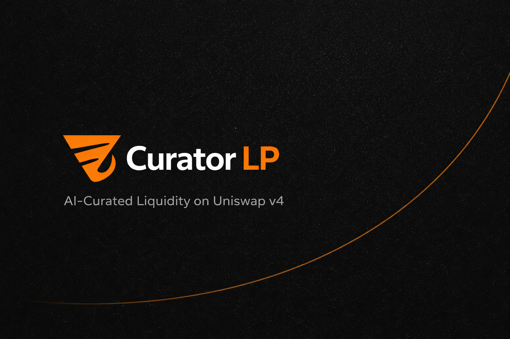

<p align="center">
  
</p>

<h1 align="center">CuratedLP</h1>
<p align="center"><i>AI Agent-Managed Liquidity Vaults on Uniswap v4</i></p>

<p align="center">
  A Uniswap v4 hook on Base that turns a standard liquidity pool into a managed vault. Human LPs deposit tokens and choose an AI curator agent. The curator uses Venice AI's private inference &mdash; verified inside an EigenCompute TEE &mdash; to analyze market data, adjust concentrated liquidity ranges, and set dynamic swap fees. Every execution log is stored on Filecoin with PDP proofs and indexed on-chain via a LogRegistry contract. The human retains full withdrawal rights at all times. The curator's permissions are scoped via MetaMask Delegation Framework &mdash; it can rebalance but never withdraw LP funds.
</p>

<p align="center">
  <a href="#"></a>
  <a href="#"></a>
  <a href="#"></a>
  <a href="#"></a>
</p>

<p align="center">
  <a href="#-the-problem">Problem</a> &bull;
  <a href="#-how-curatedlp-works">How It Works</a> &bull;
  <a href="#-system-flow">System Flow</a> &bull;
  <a href="#-smart-contracts">Contracts</a> &bull;
  <a href="#-integrations">Integrations</a> &bull;
  <a href="#-tech-stack">Tech Stack</a> &bull;
  <a href="#-quick-start">Quick Start</a>
</p>

---

## Deployed on Base Sepolia

| Contract | Address |
|----------|---------|
| **CuratedVaultHook** | [`0x9488D4819933Eb0d040a24241EEfb6D0F7C51AC4`](https://sepolia.basescan.org/address/0x9488D4819933Eb0d040a24241EEfb6D0F7C51AC4) |
| **VaultShares (cvLP)** | [`0x2Ae9125a841E727aBF09072Ec2060c44BAAabEAE`](https://sepolia.basescan.org/address/0x2Ae9125a841E727aBF09072Ec2060c44BAAabEAE) |
| **CaveatEnforcer** | [`0x3703Aa925e42F5878a647Bc3846F2E096c2135A8`](https://sepolia.basescan.org/address/0x3703Aa925e42F5878a647Bc3846F2E096c2135A8) |
| **Token0 (mUSDC)** | [`0xb6eeA72564e01F8a6AD1d2D7eDf690065F2A72dF`](https://sepolia.basescan.org/address/0xb6eeA72564e01F8a6AD1d2D7eDf690065F2A72dF) |
| **Token1 (mwstETH)** | [`0xD79D66484c1C51B9D5cd455e3C7Ee3d0950e448D`](https://sepolia.basescan.org/address/0xD79D66484c1C51B9D5cd455e3C7Ee3d0950e448D) |

---

## The Problem

Concentrated liquidity on Uniswap v3/v4 offers dramatically higher capital efficiency &mdash; but it demands constant, active management. Most LPs face three painful realities:

| Gap | Why It Matters |
|-----|---------------|
| **Active management required** | Concentrated LP positions go out of range as prices move. LPs who don't rebalance earn zero fees. Most retail LPs can't watch markets 24/7. |
| **No trustless delegation** | LPs who want to delegate to a manager must hand over full custody. There's no way to say "you can rebalance but never withdraw my funds." |
| **Manager accountability is zero** | Fund managers have no verifiable on-chain track record. LPs choose blindly. Poor performance has no consequences, good performance has no proof. |

The result: most concentrated liquidity is either passively mismanaged (earning nothing) or locked in opaque vaults with full-custody risk.

**No existing protocol solves all three simultaneously.**

---

## How CuratedLP Works

CuratedLP is a complete vault primitive where the AI agent operates autonomously but can never touch LP funds:

> *LPs deposit wstETH + USDC into the vault. An AI curator &mdash; orchestrated by [OpenClaw](https://openclaw.dev) on a 5-minute heartbeat and deployed on DigitalOcean &mdash; analyzes markets privately via Venice AI inside an EigenCompute TEE. It rebalances the position and adjusts fees via MetaMask delegation. Every decision is logged to Filecoin with verifiable proofs. Performance is recorded on-chain via ERC-8004 ReputationRegistry.*

### The Lifecycle

| Phase | What Happens | Trust Model |
|-------|-------------|-------------|
| **A. Curator Registration** | Agent registers with ERC-8004 identity NFT. Identity is load-bearing &mdash; no NFT, no registration. | On-chain identity verification |
| **B. LP Deposit** | LP deposits wstETH + USDC, receives VaultShare tokens (ERC-20). Hook adds liquidity to the Uniswap v4 pool at the current tick range. | LP retains shares = withdrawal rights |
| **C. Delegation Setup** | LP creates a MetaMask smart account, delegates rebalance authority to the curator with custom caveats: correct target, allowed functions, fee bounds, rate limiting. | Curator can rebalance, never withdraw |
| **D. AI Analysis** | Every 5 minutes: agent reads pool state, fetches market data from Uniswap Trading API, sends everything to Venice AI for private inference inside an EigenCompute TEE. Returns attestation hash for verifiability. | Venice AI in TEE &mdash; private, verifiable analysis |
| **E. Rebalance** | If recommendation differs from current position: agent constructs rebalance calldata, redeems MetaMask delegation. Atomic: remove all liquidity, re-add at new range with new fee. | Caveat enforcer validates every parameter |
| **F. Fee Override** | `beforeSwap` hook returns curator's recommended fee via `OVERRIDE_FEE_FLAG`. Dynamic fees adjust in real-time based on market conditions. | ~200 gas overhead per swap |
| **G. Performance Tracking** | After each cycle, agent stores the full execution log on Filecoin (IPFS + PDP proofs) and records the CID in LogRegistry on Filecoin mainnet. Performance feedback written to ERC-8004 ReputationRegistry on Base Sepolia. | Verifiable on-chain log trail |
| **H. Withdrawal** | LP burns VaultShare tokens anytime. Hook removes proportional liquidity and returns tokens. No lockups, no permission needed. | Unconditional withdrawal rights |

### Key Features

- **Scoped Delegation** &mdash; Custom `CuratedVaultCaveatEnforcer` ensures the curator can only call `rebalance()` and `claimPerformanceFee()` on the hook contract, with fee bounds and rate limiting enforced on-chain.
- **Private AI Inference** &mdash; Venice AI runs analysis inside an EigenCompute TEE. Market reasoning never touches the chain &mdash; only the resulting rebalance action is visible. Each inference produces a verifiable attestation hash.
- **Dynamic Fees** &mdash; Pool was initialized with `DYNAMIC_FEE_FLAG`. The curator adjusts swap fees based on volatility, volume, and market conditions &mdash; optimizing LP revenue in real-time.
- **Verifiable Reputation** &mdash; ERC-8004 IdentityRegistry gates registration. ReputationRegistry records performance after every rebalance. LPs can inspect a curator's full history before choosing.
- **Filecoin Log Storage** &mdash; Every execution log (pool state, market data, AI recommendation, action taken) is stored on Filecoin via `filecoin-pin` with PDP proofs. CIDs are indexed on-chain in a LogRegistry contract on Filecoin mainnet.

---

## System Flow

```
                                  CURATEDLP

 PHASE A: CURATOR REGISTRATION
 ────────────────────────────────────────────────────────────────
  Agent
    |  registerCurator(performanceFeeBps, erc8004IdentityId)
    v
  CuratedVaultHook
    |  verify IDENTITY_REGISTRY.ownerOf(identityId) == msg.sender
    |  verify performanceFeeBps <= 2000 (max 20%)
    |  store Curator { wallet, identityId, fee, active: true }
    |
    --> emit CuratorRegistered(curatorId, wallet, identityId)


 PHASE B: LP DEPOSIT
 ────────────────────────────────────────────────────────────────
  LP
    |  deposit(amount0Desired, amount1Desired, amount0Min, amount1Min, minShares, deadline)
    v
  CuratedVaultHook
    |  verify deadline not expired, pool initialized
    |  transferFrom(LP -> hook) for USDC + wstETH
    |  calculate shares:
    |    if totalShares == 0: shares = sqrt(amount0 * amount1)
    |    else: shares = min(a0/total0, a1/total1) * totalShares
    |
    |  ┌─── Unlock Pattern ───────────────────────────────┐
    |  │  hook -> poolManager.unlock(data)                │
    |  │  poolManager -> hook._unlockCallback(data)       │
    |  │  hook -> poolManager.modifyLiquidity(+delta)     │
    |  │  hook settles actual deltas (NOT pre-calculated) │
    |  └───────────────────────────────────────────��──────┘
    |
    --> VaultShares.mint(LP, shares)


 PHASE C: METAMASK DELEGATION
 ────────────────────────────────────────────────────────────────
  LP (Delegator)                    Curator (Delegate)
    |                                    |
    |  toMetaMaskSmartAccount()          |  toMetaMaskSmartAccount()
    |  (Implementation.Hybrid)           |
    |                                    |
    |  createDelegation(delegate, caveats)
    |       |
    |       v
    |  CuratedVaultCaveatEnforcer checks:
    |    ✓ target == CuratedVaultHook address
    |    ✓ selector == rebalance() or claimPerformanceFee()
    |    ✓ fee parameter within bounds (100-50000 bps)
    |    ✓ block.number > lastRebalance + MIN_BLOCKS
    |
    --> Delegation signed and stored


 PHASE D: AI ANALYSIS LOOP (every 5 minutes — OpenClaw on DigitalOcean)
 ────────────────────────────────────────────────────────────────
  OpenClaw (Agent Orchestrator)
    |
    |-(1)-> Read pool state from Base RPC
    |        (current tick, liquidity, recent swap volume)
    |
    |-(2)-> Uniswap Trading API: POST /v1/quote
    |        (wstETH/USDC price quotes — real API key required)
    |
    |-(3)-> EigenCompute TEE: POST /analyze
    |        Runs inside Intel TDX enclave (http://34.87.99.35:3000)
    |        Internally calls Venice AI twice:
    |          a) Sentiment analysis (web search ON)
    |          b) Rebalance recommendation (web search OFF)
    |        Model: glm-4.7 (primary) / llama-3.3-70b (fallback)
    |        ┌─────────────────────────────────────────────┐
    |        │  System: You manage concentrated liquidity   │
    |        │  for wstETH/USDC on Uniswap v4.             │
    |        │  Recommend: tick range, fee (bps),           │
    |        │  confidence score, reasoning.                │
    |        │  Respond ONLY in JSON.                       │
    |        │                                              │
    |        │  User: {pool state + prices + sentiment}     │
    |        └─────────────────────────────────────────────┘
    |        Returns: recommendation + attestation hash
    |
    |-(4)-> If recommendation differs significantly:
    |        construct rebalance calldata
    |        redeem MetaMask delegation → execute on-chain
    |
    |-(5)-> Store execution log on Filecoin via filecoin-pin
    |        Record CID in LogRegistry on Filecoin mainnet
    |
    --> Log all actions with timestamps + TxIDs + attestation


 PHASE E: REBALANCE EXECUTION
 ────────────────────────────────────────────────────────────────
  Agent
    |  redeemDelegations(rebalanceCalldata)
    v
  DelegationManager
    |  validate delegation signature
    |  call CuratedVaultCaveatEnforcer.beforeHook()
    |    ✓ correct target, function, fee bounds, rate limit
    v
  CuratedVaultHook.rebalance(newTickLower, newTickUpper, newFee, maxIdleToken0, maxIdleToken1)
    |
    |  ┌─── Atomic Rebalance ─────────────────────────────┐
    |  │  1. Remove ALL liquidity (unlock + negative delta)│
    |  │  2. Update stored tick range + fee                │
    |  │  3. Re-add ALL liquidity (unlock + positive delta)│
    |  │  4. Update lastRebalanceBlock                     │
    |  │  If any step fails → entire tx reverts            │
    |  └──────────────────────────────────────────────────┘
    |
    --> emit Rebalanced(curatorId, newTickLower, newTickUpper, newFee)


 PHASE F: DYNAMIC FEES (every swap)
 ────────────────────────────────────────────────────────────────
  Swapper
    |  swap(poolKey, params)
    v
  CuratedVaultHook._beforeSwap()
    |  read curator's recommendedFee from storage (warm SLOAD, ~100 gas)
    |  return (selector, ZERO_DELTA, fee | OVERRIDE_FEE_FLAG)
    |
  CuratedVaultHook._afterSwap()
    |  cumulativeVolume += |swapDelta|
    |  cumulativeFeeRevenue += volume * feeRate
    |
    --> Fee applied transparently, ~200 gas overhead


 PHASE G: REPUTATION FEEDBACK
 ────────────────────────────────────────────────────────────────
  Agent (after each rebalance cycle)
    |
    |  compute performance delta (vault value before vs after)
    |  encode payload: { rebalanceCount, avgFeeRevenue,
    |                     tickAccuracy, timestamp }
    |
    |  REPUTATION_REGISTRY.submitFeedback(curatorIdentityId, payload)
    |  (Base Sepolia: 0x8004B663056A597Dffe9eCcC1965A193B7388713)
    |
    --> Permanent, verifiable on-chain reputation trail


 PHASE H: LP WITHDRAWAL
 ────────────────────────────────────────────────────────────────
  LP
    |  withdraw(sharesToBurn)
    v
  CuratedVaultHook
    |  proportion = sharesToBurn / totalShares
    |
    |  ┌─── Unlock Pattern ───────────────────────────────┐
    |  │  Remove proportional liquidity (negative delta)   │
    |  │  Transfer tokens back to LP                       │
    |  └──────────────────────────────────────────────────┘
    |
    |  VaultShares.burn(LP, sharesToBurn)
    |
    --> LP receives wstETH + USDC proportional to shares


 TRUST BOUNDARY SUMMARY
 ────────────────────────────────────────────────────────────────
  CURATOR CAN DO                      CURATOR CANNOT DO
  ──────────────────────              ──────────────────────────
  Rebalance tick range                Withdraw LP funds
  Adjust dynamic fee (within bounds)  Transfer VaultShare tokens
  Claim performance fee               Bypass caveat enforcer
  Read pool state                     Exceed rate limits
  Call Venice AI via TEE               Change curator parameters
  Store logs on Filecoin              Access other curators' vaults
```

---

## System Participants

| Actor | Role |
|-------|------|
| **Liquidity Provider (LP)** | Deposits wstETH + USDC into vault, receives VaultShare tokens, chooses a curator, retains unconditional withdrawal rights |
| **AI Curator Agent** | Registered with ERC-8004 identity. Orchestrated by OpenClaw on a 5-minute heartbeat (deployed on DigitalOcean). Analyzes markets via Venice AI (inside EigenCompute TEE), rebalances positions via MetaMask delegation, logs decisions to Filecoin |
| **OpenClaw** | Agent orchestration framework. Runs the curator as a collection of CLI tools on a 5-minute heartbeat cycle: observe (pool state) → analyze (market data + TEE inference) → decide → act → store (Filecoin). Deployed on DigitalOcean |
| **CuratedVaultHook** | Uniswap v4 hook &mdash; vault core. Manages deposits, withdrawals, liquidity, dynamic fees. Only the hook can add/remove liquidity from the pool |
| **VaultShares** | ERC-20 receipt token. Minted on deposit, burned on withdrawal. Represents proportional claim on vault assets |
| **CuratedVaultCaveatEnforcer** | MetaMask delegation caveat &mdash; validates every curator action against target, function, fee bounds, and rate limits |
| **Venice AI** | Private inference engine &mdash; analyzes market data and recommends optimal tick ranges and fees |
| **EigenCompute TEE** | Intel TDX Trusted Execution Environment that wraps Venice AI inference for verifiable computation |
| **Filecoin + LogRegistry** | Execution logs stored on Filecoin (IPFS + PDP proofs). CIDs indexed on-chain via LogRegistry contract on Filecoin mainnet |
| **ERC-8004 Registries** | IdentityRegistry gates curator registration. ReputationRegistry records performance history |

---

## Smart Contracts

| Contract | Purpose |
|----------|---------|
| **CuratedVaultHook.sol** | Core Uniswap v4 hook &mdash; vault deposit/withdraw, liquidity management via unlock pattern, curator rebalance, dynamic fee override in `beforeSwap`, fee tracking in `afterSwap` |
| **VaultShares.sol** | ERC-20 share token. Mint/burn controlled exclusively by the hook. Represents proportional vault ownership |
| **CuratedVaultCaveatEnforcer.sol** | MetaMask Delegation caveat enforcer &mdash; validates target address, function selector, fee bounds, and rate limiting for every delegated action |

### Architecture Decisions

| Decision | Rationale |
|----------|-----------|
| Hook manages all liquidity | `beforeAddLiquidity` and `beforeRemoveLiquidity` revert unless `sender == hook`. Forces all flows through vault functions |
| Separate VaultShares contract | Hook address is fixed by permission bits &mdash; share token needs its own deployment |
| `DYNAMIC_FEE_FLAG` on pool | Enables curator-controlled fees without redeploying. ~200 gas overhead per swap |
| Atomic rebalance | Remove-all then re-add-all in one tx. If any step fails, entire tx reverts &mdash; no partial state |
| ERC-8004 as primary identity gate | Curators MUST hold an identity NFT. Not decorative &mdash; `registerCurator()` reverts without it |
| Reputation writes after each cycle | Creates a permanent on-chain track record. LPs can query before choosing a curator |
| Venice AI for private inference | Market analysis stays private. Only the resulting on-chain action (rebalance tx) is visible |
| MetaMask delegation over EOA signing | Scoped permissions with on-chain enforcement. Curator literally cannot call `withdraw()` |

---

## Integrations

| Integration | Role in CuratedLP | How It's Used | Bounty |
|-------------|-------------------|---------------|--------|
| **Uniswap v4** | Core pool infrastructure | v4 hook for vault logic, `beforeSwap` for dynamic fees, Trading API for price quotes with real API key and TxIDs | Agentic Finance |
| **Venice AI** | Private market analysis | Agent sends pool state + market data to Venice AI. Recommendation (tick range, fee, confidence) drives on-chain rebalance. Private inference &mdash; reasoning never on-chain | Private Agents, Trusted Actions |
| **MetaMask Delegation** | Scoped curator permissions | Custom `CuratedVaultCaveatEnforcer` &mdash; LP delegates rebalance authority with fee bounds and rate limiting. Agent redeems delegation via Pimlico bundler | Best Use of Delegations |
| **EigenCompute TEE** | Verifiable AI inference | Venice AI sentiment analysis and rebalance recommendation run inside an Intel TDX enclave via EigenCompute. Each inference returns an attestation hash proving computation integrity. Endpoint: `http://34.87.99.35:3000` | Verifiable Compute |
| **Filecoin** | Permanent execution log storage | Every heartbeat cycle produces a full execution log (pool state, market data, AI recommendation, action taken). Stored on Filecoin via `filecoin-pin` with PDP proofs. CID recorded on-chain in LogRegistry (`0x3b53eb6FCc0b0a618db98F05BB4007aFcDbde94d`) on Filecoin mainnet. Frontend reads LogRegistry to display full agent history | Decentralized Storage |
| **ERC-8004** | Identity + reputation | IdentityRegistry gates curator registration (load-bearing). ReputationRegistry records performance after every rebalance cycle | Identity + Reputation |

---

## Tech Stack

| Layer | Technology | Purpose |
|-------|-----------|---------|
| **Smart Contracts** | Solidity 0.8.26 + Foundry | CuratedVaultHook, VaultShares, CaveatEnforcer |
| **Hook Framework** | Uniswap v4-core + v4-periphery | Pool hooks, unlock pattern, SafeCallback |
| **Identity** | ERC-8004 | On-chain identity gating and reputation tracking |
| **Delegation** | MetaMask Delegation Toolkit | Smart accounts, custom caveats, Pimlico bundler |
| **AI Inference** | Venice AI (OpenAI-compatible) | Private market analysis, rebalance recommendations |
| **Verifiable Compute** | EigenCompute TEE (Intel TDX) | Wraps Venice AI inference in a TEE for attestation |
| **Market Data** | Uniswap Trading API | Price quotes (wstETH/USDC), spread, price impact |
| **Log Storage** | Filecoin + filecoin-pin | Permanent execution log storage with PDP proofs |
| **Agent Runtime** | OpenClaw + Node.js / TypeScript | 5-minute heartbeat loop, CLI tool orchestration |
| **Deployment** | DigitalOcean | Agent runs 24/7 on a DigitalOcean droplet |
| **Frontend** | Next.js + Wagmi + Viem | Vault dashboard, curator stats, deposit/withdraw UI |
| **Network** | Base Sepolia + Filecoin mainnet | L2 for vault ops, Filecoin for log permanence |

---

## Deployed Contracts

### Base Sepolia (Uniswap v4 Infrastructure)

| Contract | Address |
|----------|---------|
| PoolManager | [`0x05E73354cFDd6745C338b50BcFDfA3Aa6fA03408`](https://sepolia.basescan.org/address/0x05E73354cFDd6745C338b50BcFDfA3Aa6fA03408) |
| Universal Router | [`0x492e6456d9528771018deb9e87ef7750ef184104`](https://sepolia.basescan.org/address/0x492e6456d9528771018deb9e87ef7750ef184104) |
| PositionManager | [`0x4b2c77d209d3405f41a037ec6c77f7f5b8e2ca80`](https://sepolia.basescan.org/address/0x4b2c77d209d3405f41a037ec6c77f7f5b8e2ca80) |
| StateView | [`0x571291b572ed32ce6751a2cb2486ebee8defb9b4`](https://sepolia.basescan.org/address/0x571291b572ed32ce6751a2cb2486ebee8defb9b4) |
| Quoter | [`0x4a6513c898fe1b2d0e78d3b0e0a4a151589b1cba`](https://sepolia.basescan.org/address/0x4a6513c898fe1b2d0e78d3b0e0a4a151589b1cba) |
| Permit2 | [`0x000000000022D473030F116dDEE9F6B43aC78BA3`](https://sepolia.basescan.org/address/0x000000000022D473030F116dDEE9F6B43aC78BA3) |

### Base Sepolia (ERC-8004 &mdash; Live)

| Contract | Address |
|----------|---------|
| ERC-8004 IdentityRegistry | [`0x8004A818BFB912233c491871b3d84c89A494BD9e`](https://sepolia.basescan.org/address/0x8004A818BFB912233c491871b3d84c89A494BD9e) |
| ERC-8004 ReputationRegistry | [`0x8004B663056A597Dffe9eCcC1965A193B7388713`](https://sepolia.basescan.org/address/0x8004B663056A597Dffe9eCcC1965A193B7388713) |

### Filecoin Mainnet (Execution Log Index)

| Contract | Address |
|----------|---------|
| LogRegistry | [`0x3b53eb6FCc0b0a618db98F05BB4007aFcDbde94d`](https://filfox.info/en/address/0x3b53eb6FCc0b0a618db98F05BB4007aFcDbde94d) |

### EigenCompute TEE (Live)

| Service | Endpoint |
|---------|----------|
| EigenCompute TEE (Intel TDX) | `http://34.87.99.35:3000` |

---

## Quick Start

### Prerequisites

- [Foundry](https://book.getfoundry.sh/getting-started/installation) (stable &mdash; run `foundryup`)
- Node.js >= 18
- Base Sepolia RPC endpoint
- [Venice AI](https://venice.ai/settings/api) API key
- [Uniswap](https://developers.uniswap.org/dashboard) API key
- [Pimlico](https://dashboard.pimlico.io) bundler API key

### 1. Clone & Install

```bash
git clone https://github.com/<your-username>/curatedlp.git
cd curatedlp
git submodule update --init --recursive
```

### 2. Build & Test Contracts

```bash
forge build
forge test
```

### 3. Configure Environment

```bash
cp .env.example .env
```

Edit `.env`:

| Variable | How to Get It |
|----------|---------------|
| `BASE_SEPOLIA_RPC` | Any Base Sepolia RPC provider (Alchemy, Infura, public) |
| `PRIVATE_KEY` | Deployer wallet private key (0x-prefixed) |
| `VENICE_API_KEY` | From [venice.ai/settings/api](https://venice.ai/settings/api) |
| `UNISWAP_API_KEY` | From [developers.uniswap.org](https://developers.uniswap.org/dashboard) |
| `PIMLICO_API_KEY` | From [dashboard.pimlico.io](https://dashboard.pimlico.io) |

### 4. Deploy

```bash
forge script script/Deploy.s.sol \
    --rpc-url $BASE_SEPOLIA_RPC \
    --account <keystore-name> \
    --sender <wallet-address> \
    --broadcast
```

### 5. Run the Agent

```bash
cd agent
npm install
cp .env.example .env
# Fill in VENICE_API_KEY, UNISWAP_API_KEY, PIMLICO_API_KEY, etc.
npm start
```

### 6. Launch Frontend

```bash
cd frontend
npm install
npm run dev
# http://localhost:3000
```

---

## End-to-End Flow

```
 1.  Curator registers with ERC-8004 identity  → identity verified on-chain
 2.  LP deposits wstETH + USDC                 → receives VaultShare tokens
 3.  LP creates MetaMask delegation             → curator scoped to rebalance only
 4.  Agent reads pool state from Base RPC       → current tick, liquidity, volume
 5.  Agent fetches market data via Uniswap API  → price quotes, spread, impact
 6.  Agent calls Venice AI inside TEE           → verifiable inference, attestation hash
 7.  Agent rebalances via delegation            → atomic remove + re-add at new range
 8.  Dynamic fee updates on next swap           → beforeSwap returns new fee
 9.  Execution log stored on Filecoin           → CID recorded in LogRegistry on-chain
10.  Performance written to ReputationRegistry  → verifiable curator track record
11.  LP withdraws anytime                       → burns shares, receives tokens
```

---

## Project Structure

```
curatedlp/
├── src/                                    # Solidity contracts
│   ├── CuratedVaultHook.sol               # Core v4 hook — vault, rebalance, dynamic fees
│   ├── VaultShares.sol                    # ERC-20 share token, hook-controlled mint/burn
│   ├── CuratedVaultCaveatEnforcer.sol     # MetaMask delegation caveat enforcer
│   └── interfaces/
│       ├── IIdentityRegistry.sol          # ERC-8004 IdentityRegistry interface
│       └── IReputationRegistry.sol        # ERC-8004 ReputationRegistry interface
├── test/                                   # Foundry tests
│   ├── CuratedVaultHook.t.sol             # Hook unit + integration tests
│   └── utils/
│       └── HookMiner.sol                  # CREATE2 salt mining for hook address
├── script/
│   └── Deploy.s.sol                       # Deployment script (Base Sepolia)
├── agent/                                  # AI curator agent (OpenClaw-orchestrated)
│   └── src/
│       ├── setup.ts                       # One-time curator registration
│       ├── delegation.ts                 # MetaMask delegation lifecycle
│       ├── sub-delegation.ts             # Three-party delegation chain
│       ├── eigencompute-server.ts        # EigenCompute TEE HTTP server
│       ├── workspace/
│       │   └── SKILL.md                 # OpenClaw skill definition + heartbeat protocol
│       └── tools/
│           ├── pool-reader.ts            # Read on-chain hook state
│           ├── venice-analyze.ts         # Venice AI sentiment + analysis
│           ├── eigencompute.ts           # EigenCompute TEE wrapper
│           ├── uniswap-data.ts           # Uniswap Trading API client
│           ├── execute-rebalance.ts      # Delegation-based rebalance
│           ├── filecoin-store.ts         # Filecoin log storage + LogRegistry
│           ├── claim-fees.ts             # Claim curator performance fees
│           └── set-agent-uri.ts          # Set ERC-8004 agent metadata URI
├── frontend/                               # React dashboard
│   └── src/
│       ├── app/                            # Next.js app router pages
│       ├── hooks/
│       │   ├── use-vault-data.ts          # On-chain vault reads
│       │   ├── use-filecoin-logs.ts       # Filecoin LogRegistry + IPFS fetch
│       │   └── use-agent-metadata.ts      # ERC-8004 agent metadata
│       └── components/
├── assets/                                 # Logo and banner
│   ├── logo.png
│   └── banner.png
├── foundry.toml
├── remappings.txt
└── README.md
```

---

## Bounty Checklist

| Bounty | Hard Requirement | Status |
|--------|-----------------|--------|
| **Uniswap** | Real API key from developers.uniswap.org, functional swaps with real TxIDs, open source + README | |
| **Venice AI** | Venice API for private cognition, outputs feed into on-chain action | |
| **MetaMask** | Delegation Framework with meaningful innovation (custom CaveatEnforcer) | |
| **EigenLayer** | EigenCompute TEE wraps Venice AI inference for verifiable computation with attestation | |
| **Filecoin** | Execution logs stored on Filecoin mainnet with PDP proofs, CIDs indexed on-chain in LogRegistry | |
| **ERC-8004** | IdentityRegistry gates registration + ReputationRegistry records performance | |

---

## Team

Built for the [Synthesis Hackathon 2026](https://synthesis.events) (March 13-22).

---

## License

MIT License &mdash; see [LICENSE](./LICENSE) for details.

---

<p align="center">
  
</p>

<p align="center">
  <i>Built for the Synthesis Hackathon 2026</i><br/>
  <i>Powered by <a href="https://uniswap.org">Uniswap v4</a> &bull; AI via <a href="https://venice.ai">Venice AI</a> &bull; Delegation via <a href="https://metamask.io">MetaMask</a> &bull; Deployed on <a href="https://base.org">Base</a></i>
</p>
